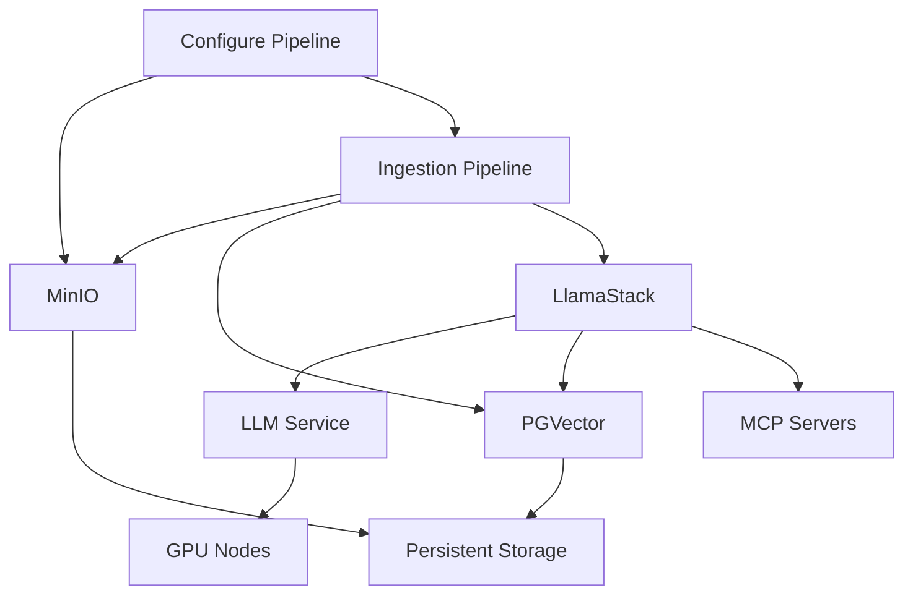

# AI Architecture Charts

A comprehensive collection of Helm charts for deploying end-to-end AI/ML infrastructure on OpenShift, featuring LlamaStack orchestration, model serving, vector databases, and supporting services.

## Overview

This repository provides production-ready Helm charts for building AI applications with components that work seamlessly together. The architecture supports various AI use cases including RAG (Retrieval-Augmented Generation), conversational AI, document processing, and AI agent workflows.

## Architecture Components

### 🧠 Core AI Services

#### [LlamaStack](./llama-stack/README.md)
Comprehensive AI orchestration platform that provides a unified API for multiple model providers, safety shields, and AI agent capabilities. Supports local models (via LLM Service), remote vLLM endpoints, and VertexAI integration.

**Key Features:**
- Multi-provider model support (local, remote, VertexAI)
- Safety shields with Llama Guard and other safety models
- AI agent capabilities with persistent memory
- Automatic model discovery and URL generation

#### [LLM Service](./llm-service/README.md)
High-performance model serving infrastructure using vLLM runtime with OpenShift AI/KServe integration. Supports GPU and CPU deployment modes with any models compatible with vLLM.

**Key Features:**
- vLLM-based model serving with OpenAI-compatible API
- Support for any vLLM-compatible models and sizes
- GPU/CPU deployment flexibility
- Tool calling and function execution support

### 📊 Data & Storage Services

#### [PGVector](./pgvector/README.md)
PostgreSQL with pgvector extension providing high-performance vector database capabilities for storing and querying embeddings in AI/ML applications.

**Key Features:**
- Vector similarity search (cosine, L2, inner product)
- Multiple index types (IVFFlat, HNSW)
- Support for various embedding dimensions
- ACID compliance with PostgreSQL reliability

#### [MinIO](./minio/README.md)
S3-compatible object storage server for documents, models, and data in AI/ML pipelines. Provides scalable storage with web console management.

**Key Features:**
- S3-compatible API
- Web-based management console
- Bucket policies and lifecycle management
- Sample file upload functionality

#### [Oracle 23ai](./oracle23ai/README.md)
Oracle Database Free 23ai with AI Vector features, providing enterprise-grade database capabilities with built-in vector operations for AI applications.

**Key Features:**
- Native vector operations and similarity search
- JSON duality and graph analytics
- Enterprise database reliability
- AI-optimized storage and indexing

### 🔧 Pipeline & Processing Services

#### [Ingestion Pipeline](./ingestion-pipeline/README.md)
Comprehensive data ingestion pipeline that processes documents from various sources (S3, GitHub, URLs) and stores vector embeddings for semantic search and RAG applications.

**Key Features:**
- Multi-source data ingestion (S3/MinIO, GitHub, URLs)
- Document chunking and embedding generation
- REST API for pipeline management
- Integration with vector databases

#### [Configure Pipeline](./configure-pipeline/README.md)
Jupyter notebook environment for RAG configuration and pipeline setup. Provides interactive tools for configuring and testing AI pipelines.

**Key Features:**
- Pre-configured Jupyter environment
- RAG pipeline configuration tools
- MinIO integration for data access
- Template and configuration management

### 🔌 Integration & Tools

#### [MCP Servers](./mcp-servers/README.md)
Model Context Protocol servers that provide external tools and capabilities to AI models, enabling AI agents to interact with external systems and APIs.

**Key Features:**
- Weather information services
- Server-Sent Events (SSE) endpoints
- Custom tool development framework
- Integration with LlamaStack agents

#### [Oracle SQLcl MCP](./oracle-sqlcl/helm/README.md)
MCP server that exposes Oracle SQLcl capabilities to AI agents via Toolhive, enabling database tooling and interactions from LlamaStack and compatible clients.

**Key Features:**
- Execute SQL/PLSQL against Oracle databases via Model Context Protocol
- Integrates with Toolhive Operator (CRDs and operator managed as chart dependencies)
- Orale connection managed via Kubernetes secrets and configurable service

## Quick Start

### Prerequisites

- OpenShift cluster
- Helm 3.x
- Sufficient storage and compute resources
- Access to container registries

### Basic Deployment

Deploy a complete AI stack with vector storage and model serving:

```bash
# 1. Deploy vector database
helm install pgvector ./pgvector/helm

# 2. Deploy object storage
helm install minio ./minio/helm

# 3. Deploy model serving
helm install llm-service ./llm-service/helm \
  --set models.llama-3-2-3b-instruct.enabled=true

# 4. Deploy LlamaStack orchestration
helm install llama-stack ./llama-stack/helm \
  --set models.llama-3-2-3b-instruct.enabled=true

# 5. Deploy ingestion pipeline
helm install ingestion-pipeline ./ingestion-pipeline/helm
```

### RAG Application Setup

For document processing and retrieval-augmented generation:

```bash
# Deploy storage and database
helm install minio ./minio/helm \
  --set sampleFileUpload.enabled=true
helm install pgvector ./pgvector/helm

# Configure pipeline
helm install configure-pipeline ./configure-pipeline/helm

# Deploy processing pipeline
helm install ingestion-pipeline ./ingestion-pipeline/helm \
  --set defaultPipeline.enabled=true \
  --set defaultPipeline.source=S3

# Deploy model serving and orchestration
helm install llm-service ./llm-service/helm \
  --set models.llama-3-2-3b-instruct.enabled=true
helm install llama-stack ./llama-stack/helm \
  --set models.llama-3-2-3b-instruct.enabled=true
```

## Integration Patterns

### LlamaStack + LLM Service
LlamaStack provides orchestration while LLM Service handles model inference:
- LLM Service deploys models as InferenceServices
- LlamaStack automatically discovers and configures model endpoints
- Unified API access through LlamaStack

### Vector Storage Integration
Both PGVector and Oracle 23ai can serve as vector databases:
- PGVector: Open-source PostgreSQL with pgvector extension
- Oracle 23ai: Enterprise database with native AI vector features
- Choose based on performance, compliance, and feature requirements

### Multi-Source Data Ingestion
Ingestion Pipeline supports various data sources:
- **S3/MinIO**: Object storage for documents and files
- **GitHub**: Repository documentation and code
- **URLs**: Direct document links and web content

## Component Dependencies



## Security Considerations

- **Secrets Management**: All components use Kubernetes secrets for credentials
- **Network Policies**: Implement network policies to restrict inter-component communication
- **RBAC**: Configure role-based access control for service accounts
- **TLS**: Enable TLS for external access and sensitive communications
- **Safety Shields**: Use Llama Guard or other safety models for content moderation

## Monitoring and Observability

- **Prometheus Integration**: Many components support Prometheus metrics
- **OpenTelemetry**: LlamaStack supports distributed tracing
- **Logging**: All components provide structured logging
- **Health Checks**: Kubernetes-native health and readiness probes

## Development and Customization

Each component is designed to be:
- **Configurable**: Extensive values.yaml configuration options
- **Extensible**: Support for custom models, tools, and integrations
- **Scalable**: Horizontal and vertical scaling capabilities
- **Production-ready**: Comprehensive monitoring and operational features

### Container Image Building

The repository includes automated container image building through GitHub workflows:

- **Supported components**: ingestion-pipeline and mcp-servers support building custom container images
- **Automated publishing**: Images are built and pushed to Quay.io with chart versioning
- **Custom development**: Add new MCP servers or modify existing components with automatic CI/CD
- **Workflow integration**: Components with source code are automatically built when chart versions are updated

To add a new buildable component, place your source code and Containerfile in the appropriate component directory and configure the GitHub workflow matrix in `.github/workflows/publish-helm-charts.yaml`.

### Helm Repository and Versioning

This project maintains a Helm repository at `https://rh-ai-quickstart.github.io/ai-architecture-charts` with full version history:

- **Version tracking**: All chart versions are preserved and available for download
- **Automated publishing**: GitHub workflow automatically packages and publishes charts to the repository
- **Backward compatibility**: Previous versions remain accessible for rollbacks and compatibility
- **Index management**: Helm repository index is automatically maintained with each release

## Support and Documentation

- **Component READMEs**: Detailed documentation for each Helm chart
- **Configuration Examples**: Real-world configuration patterns
- **Troubleshooting Guides**: Common issues and solutions
- **Integration Examples**: How components work together

## Using Charts as Dependencies

These charts can be used standalone or as dependencies in larger AI applications. Each chart is designed to work independently or as part of a composed solution.

### Standalone Deployment

Each chart can be deployed individually:

```bash
# Deploy individual components
helm install pgvector ./pgvector/helm
helm install minio ./minio/helm
helm install llm-service ./llm-service/helm
```

### Chart Dependencies

Reference these charts as dependencies in your own Chart.yaml without requiring a Helm repository:

```yaml
# Chart.yaml for your AI application
apiVersion: v2
name: my-ai-application
version: 1.0.0

dependencies:
  - name: pgvector
    version: "0.1.0"
    repository: "file://../ai-architecture-charts/pgvector/helm"
  
  - name: minio
    version: "0.1.0"
    repository: "file://../ai-architecture-charts/minio/helm"
  
  - name: llm-service
    version: "0.1.0"
    repository: "file://../ai-architecture-charts/llm-service/helm"
  
  - name: llama-stack
    version: "0.2.18"
    repository: "file://../ai-architecture-charts/llama-stack/helm"
  
  - name: ingestion-pipeline
    version: "0.2.18"
    repository: "file://../ai-architecture-charts/ingestion-pipeline/helm"
```

### Configuring Subcharts

Configure the dependent charts in your values.yaml:

```yaml
# values.yaml for your AI application
pgvector:
  secret:
    dbname: "my_ai_app_vectors"
  extraDatabases:
    - name: agent_memory
      vectordb: true

minio:
  secret:
    user: "ai_app_user"
    password: "secure_password"
  sampleFileUpload:
    enabled: true
    bucket: "ai-documents"

llm-service:
  models:
    llama-3-2-3b-instruct:
      enabled: true
    llama-guard-3-8b:
      enabled: true

llama-stack:
  models:
    llama-3-2-3b-instruct:
      enabled: true
    llama-guard-3-8b:
      enabled: true
      registerShield: true

ingestion-pipeline:
  defaultPipeline:
    enabled: true
    source: S3
    S3:
      bucket_name: ai-documents
      endpoint_url: http://minio:9000
```

### Shared Configuration with Global Values

Use global values to configure multiple charts simultaneously, reducing duplication:

```yaml
# values.yaml for your AI application
global:
  models:
    llama-3-2-3b-instruct:
      enabled: true
    llama-guard-3-8b:
      enabled: true
      registerShield: true
  
  mcp-servers:
    mcp-weather:
      deploy: true

# Individual chart configurations
pgvector:
  secret:
    dbname: "my_ai_app_vectors"

minio:
  sampleFileUpload:
    enabled: true
    bucket: "ai-documents"

# Global models will be merged with local configurations
# Both llm-service and llama-stack will use the global.models settings
```

### Deployment Workflow

```bash
# 1. Update dependencies
helm dependency update

# 2. Deploy complete AI stack
helm install my-ai-app . \
  --namespace my-ai-app \
  --create-namespace

# 3. Verify deployment
helm list -n my-ai-app
```

This approach allows you to compose comprehensive AI applications by combining these foundational charts with your own application-specific components while minimizing configuration duplication.

## Contributing

When contributing to this repository:
1. Follow OpenShift best practices
2. Update component READMEs for any changes
3. Test integrations between components
4. Ensure security and operational standards

